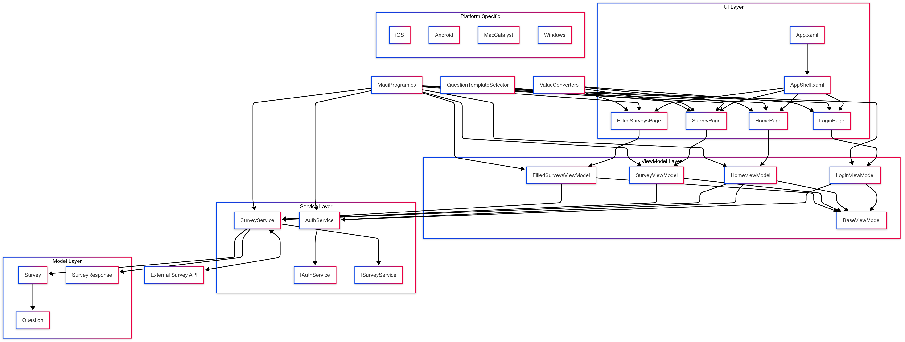

# 🌟 Field Survey MAUI App


A robust cross-platform mobile application designed for conducting field surveys following disasters. Built with **.NET MAUI** using the MVVM architecture pattern, this app enables field workers to collect critical data through customizable surveys with various question types including geolocation capture.

---

## ✨ FEATURES

- ✅ **Cross-platform** - Works on iOS, Android, Windows, and macOS
- ✅ **Authentication** - Secure login system
- ✅ **Dynamic surveys** - Support for multiple question types:
  - Text input
  - Numeric data
  - Date selection
  - Multiple choice
  - Location data (GPS coordinates)
- ✅ **Offline capability** - Submit when connectivity is restored
- ✅ **Survey management** - View all previously submitted surveys
- ✅ **MVVM architecture** - Clean separation of concerns
- ✅ **Dependency Injection** - For testable and maintainable code

---

## 🏗️ ARCHITECTURE OVERVIEW

The application follows the MVVM (Model-View-ViewModel) architecture pattern:

```
FieldSurveyMAUIApp/
├── Models/               # Data models
├── Views/                # UI pages/components
├── ViewModels/           # Business logic layer
├── Services/             # Backend communication & business services
│   └── Interfaces/       # Service contracts
└── Converters/           # Value converters for UI
```

### Architecture Diagram



---

## 📱 APP SCREENSHOTS

### iOS Screenshots
| Login Screen | Survey List | Survey Form | Location Capture |
|-------------|-------------|-------------|-----------------|
|  |  |  |  |

### Android Screenshots
| Login Screen | Survey List | Survey Form | Location Capture |
|-------------|-------------|-------------|-----------------|
|  |  |  |  |

### macOS Screenshots
| Login Screen | Survey List | Survey Form | Location Capture |
|-------------|-------------|-------------|-----------------|
|  |  |  |  |

### Completed Surveys View
| iOS | Android | macOS |
|-----|---------|-------|
|  |  |  |

> **Note:** Place your actual application screenshots in the `/screenshots` directory using the naming convention shown above.

---

## 🛠️ PROJECT STRUCTURE

### 🔹 Views (UI Layer)
- [LoginPage](Views/LoginPage.xaml) - User authentication
- [HomePage](Views/HomePage.xaml) - Displays available surveys
- [SurveyPage](Views/SurveyPage.xaml) - Dynamic survey form
- [FilledSurveysPage](Views/FilledSurveysPage.xaml) - Shows submitted responses

### 🔹 ViewModels (Business Logic)
- [BaseViewModel](ViewModels/BaseViewModel.cs) - Common ViewModel functionality
- [LoginViewModel](ViewModels/LoginViewModel.cs) - Login logic
- [HomeViewModel](ViewModels/HomeViewModel.cs) - Survey listing
- [SurveyViewModel](ViewModels/SurveyViewModel.cs) - Survey interaction
- [FilledSurveysViewModel](ViewModels/FilledSurveysViewModel.cs) - Response management

### 🔹 Models (Data)
- [Survey](Models/Survey.cs) - Survey structure
- [Question](Models/Question.cs) - Question with various types
- [SurveyResponse](Models/SurveyResponse.cs) - Submitted response data

### 🔹 Services
- [AuthService](Services/AuthService.cs) - User authentication
- [SurveyService](Services/SurveyService.cs) - API communication for surveys

---

## 🚀 GETTING STARTED

### Prerequisites
- .NET 9.0 SDK
- Visual Studio 2022 or Visual Studio for Mac (with .NET MAUI workload)
- Android SDK for Android development
- Xcode (for iOS/macOS development)

### Setup & Run
1. **Clone the repository**
   ```bash
   git clone https://github.com/yourusername/FieldSurveyMAUIApp.git
   cd FieldSurveyMAUIApp
   ```

2. **Open in Visual Studio**
   - Double-click the `.sln` file or open via Visual Studio

3. **Build the project**
   ```bash
   dotnet build
   ```

4. **Run on desired platform**
   - Select target platform (Android, iOS, Windows, macOS)
   - Press F5 or click Run

---

## 🧰 TECHNICAL IMPLEMENTATION

### Authentication
- Token-based authentication with secure storage
- Login screen with validation

### Survey Management
- Dynamic rendering of different question types
- Real-time location capture with device GPS
- Form validation for required questions

### API Communication
- RESTful API integration
- Async operations for responsive UI
- Error handling and retry mechanisms

---

## 🌐 BACKEND INFRASTRUCTURE

The application connects to a RESTful API backend built with Python and hosted on PythonAnywhere.

### Backend Architecture

- **Framework**: Python with Flask/Django REST framework
- **Hosting**: PythonAnywhere cloud platform
- **Base URL**: `https://akshat15.pythonanywhere.com`

### API Endpoints

| Endpoint | Method | Description | Parameters |
|----------|--------|-------------|------------|
| `/api/login` | POST | User authentication | `username`, `password` |
| `/api/surveys` | GET | List all available surveys | None |
| `/api/surveys/{id}` | GET | Get detailed survey information | `id` (path parameter) |
| `/api/surveys/{id}/responses` | POST | Submit a completed survey | `responses` (question-answer pairs) |
| `/api/surveyResponses` | GET | Retrieve submitted survey responses | None |

### Data Flow

1. **Authentication**: Secure token-based authentication with the backend
2. **Survey Retrieval**: The app fetches available surveys from the backend
3. **Survey Submission**: Completed surveys are formatted and sent to the API
4. **Response Storage**: Survey responses are securely stored in a database
5. **Response Retrieval**: Submitted responses can be retrieved and displayed

### Implementation Details

The mobile app communicates with the backend using HttpClient with the following features:
- JSON serialization/deserialization
- Error handling with automatic retries
- Proper formatting of complex data (like location coordinates)
- Support for different question types in the API

---

## 📋 REQUIREMENTS

- **iOS**: 15.0 or later
- **Android**: API level 21 (Android 5.0) or later
- **Windows**: Windows 10 version 17763.0 or later
- **macOS**: macOS Catalina 15.0 or later

---

## 🤝 CONTRIBUTING

1. Fork the repository
2. Create your feature branch (`git checkout -b feature/amazing-feature`)
3. Commit your changes (`git commit -m 'Add some amazing feature'`)
4. Push to the branch (`git push origin feature/amazing-feature`)
5. Open a Pull Request

---

## 📄 LICENSE

This project is licensed under the MIT License - see the LICENSE file for details.

---

## ACKNOWLEDGMENTS

- Built with [.NET MAUI](https://dotnet.microsoft.com/apps/maui)
- Using [CommunityToolkit.Mvvm](https://github.com/CommunityToolkit/dotnet) for MVVM implementation
